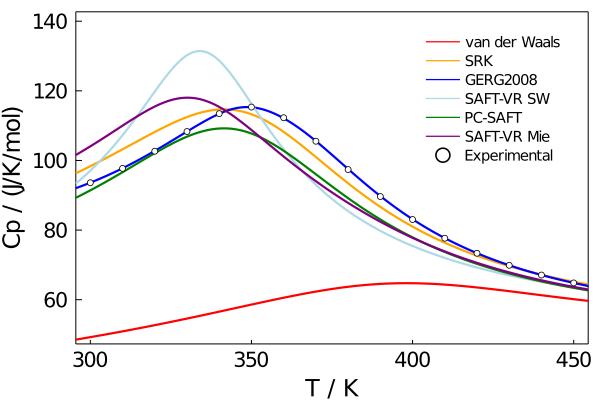
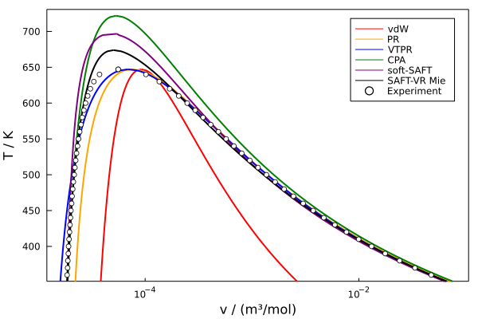
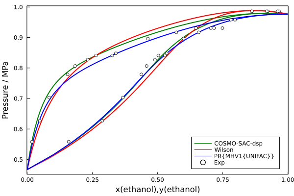

[](https://zenodo.org/badge/latestdoi/267659508)
[](https://github.com/ClapeyronThermo/Clapeyron.jl/actions)
[](https://codecov.io/gh/ClapeyronThermo/Clapeyron.jl)
[](https://clapeyronthermo.github.io/Clapeyron.jl/dev)
[](https://julialang.zulipchat.com/#narrow/stream/265161-Clapeyron.2Ejl)

<picture>
  <source media="(prefers-color-scheme: dark)" srcset="docs/Clapeyron_logo_dark.svg">
  <source media="(prefers-color-scheme: light)" srcset="docs/Clapeyron_logo.svg">
  
</picture>

Welcome to Clapeyron! This module provides both a large library of thermodynamic models and a framework for one to easily implement their own models.

The official manuscript is in ACS. https://pubs.acs.org/doi/10.1021/acs.iecr.2c00326. There is also a preprint available at arxiv: https://arxiv.org/abs/2201.08927

We have also presented at the JuliaCon 2021 conference! Feel free to take a look at our talk:

[](https://www.youtube.com/watch?v=Re5qI-9zyIM "Clapeyron.jl: An Extensible Implementation of Equations of State | Paul Yew et al | JuliaCon2021")

We support many equations of state and properties. Some examples of figures you can create are shown below:

- Isobaric heat capacity of carbon dioxide at 20 MPa:

   

- Water VLE envelope:

  

- Ethanol+water Pxy diagram at 423.15 K:

  

- pT-isopleth of methanol+cyclohexane generated using PC-SAFT:


If you find any issues, feel free to contact us directly on the [Zulip Channel](https://julialang.zulipchat.com/#narrow/stream/265161-Clapeyron.2Ejl), or open a Github issue. 

# Installing Clapeyron

The minimum supported version is Julia 1.6. To install Clapeyron, launch Julia with

```
> julia
```

Hit the ```]``` key to enter Pkg mode, then type

```
Pkg> add Clapeyron
```
Or to add the development version:
```
Pkg> add https://github.com/ClapeyronThermo/Clapeyron.jl#master
```
Exit Pkg mode by hitting backspace.

Now you may begin using functions from the Clapeyron library by entering the command

```
using Clapeyron
```

To remove the package, hit the ```]``` key to enter Pkg mode, then type

```
Pkg> rm Clapeyron
```
# Citing Clapeyron

If you are using Clapeyron for your research work, please cite the following:

```
@article{Clapeyron-2022,
    title={Clapeyron.jl: An Extensible, Open-Source Fluid Thermodynamics Toolkit},
    author={Pierre J. Walker, Hon-Wa Yew, and Andrés Riedemann},
    journal={Ind. Eng. Chem. Res.},
    volume={61},
    number={20},
    pages={7130--7153},
    year={2022},
    publisher={American Chemical Society},
    doi={doi/10.1021/acs.iecr.2c00326},
    url={https://pubs.acs.org/doi/10.1021/acs.iecr.2c00326}
}
```

# Package in active Development

Note that at its current stage, Clapeyron is still in the early stages of development, and things may be moving around or changing rapidly, but we are very excited to see where this project may go!

We are open to contributions. New models, improved methods and more databases are always appreciated!