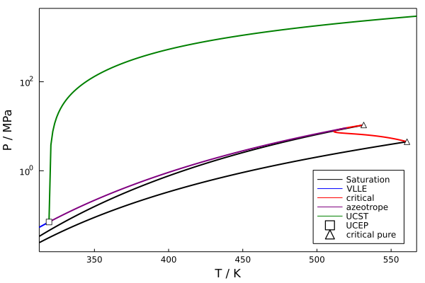

[](https://zenodo.org/badge/latestdoi/267659508)
[](https://github.com/ypaul21/Clapeyron.jl/actions)
[](https://codecov.io/gh/ypaul21/Clapeyron.jl)
[](https://ypaul21.github.io/Clapeyron.jl/dev)


Welcome to Clapeyron! This module provides both a large library of equations of state and a framework for one to easily implement their own equations of state.

We have recently presented at the JuliaCon 2021 conference! Feel free to take a look at our talk:

[](https://www.youtube.com/watch?v=Re5qI-9zyIM "Clapeyron.jl: An Extensible Implementation of Equations of State | Paul Yew et al | JuliaCon2021")

We support many equations of state and properties. Some examples of figures you can create are shown below:

- Isobaric heat capacity of carbon dioxide at 20 MPa:

  

- Water VLE enveloppe:

  

- Ethanol+water Pxy diagram at 423.15 K:

  

- pT-isopleth of methanol+cyclohexane generated using PC-SAFT:



We intend to provide functions for users to generate these figures themselves.

Note that at its current stage, Clapeyron is still in the very early stages of development, and things may be moving around or changing rapidly, but we are very excited to see where this project may go!

# Installing Clapeyron

To install Clapeyron, launch Julia with

```julia
> julia
```

Hit the ```]``` key to enter Pkg mode, then type

```julia
Pkg> add Clapeyron
```
Or to add the development version:
```julia
Pkg> add https://github.com/ypaul21/Clapeyron.jl#development
```
Exit Pkg mode by hitting backspace.

Now you may begin using functions from the Clapeyron library by entering the command

```
using Clapeyron
```

To remove the package, hit the ```]``` key to enter Pkg mode, then type

```julia
Pkg> rm Clapeyron
```
