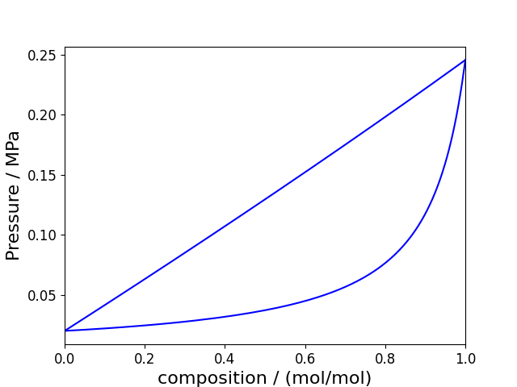
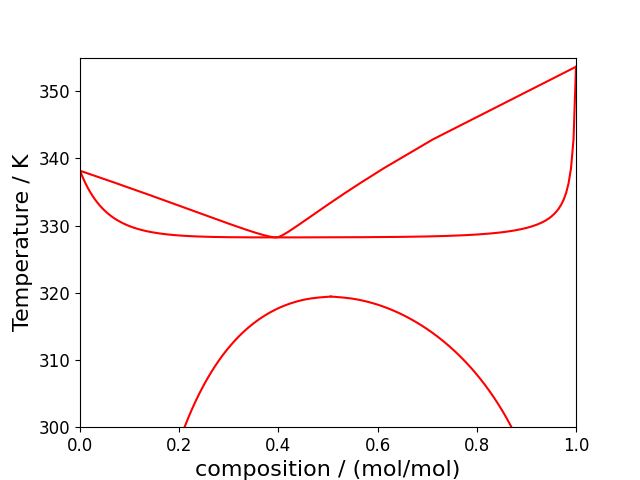
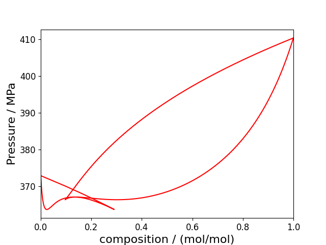
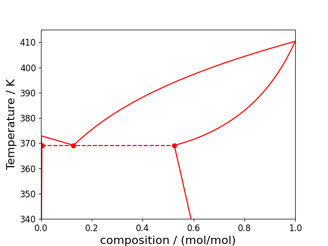

# Binary phase diagrams
When handling two components, we introduce an additional variable to our parameter space: composition. Typically, when visualising the phase space, we would like to visualise it on the temperature, pressure and/or composition axes. However, to do so on a 2D figure will require us to fix one of these variables while varying the other two. In this tutorial, we'll go over how to obtain the varying types of binary phase diagrams using Clapeyron.

Note that this tutorial will focus on 'conventional' binary fluid-phase diagrams (i.e. mixtures of small molecules). Other tutorials will go over other types of systems (such as polymer mixtures, solid-fluid equilibrium and electrolytes).

## Simple binary phase diagrams
As a first step, we'll consider what we refer to as simple binary phase diagrams. Here, we'll vary the composition of the two components but fix either temperature or pressure, also known as *pxy* and *Txy* binary phase diagrams, respectively. Consider a binary mixture of $n$-butane and $n$-hexane:
```julia
julia> model = PR(["hexane","butane"])
PR{BasicIdeal, PRAlpha, NoTranslation, vdW1fRule} with 2 components:
 "hexane"
 "butane"
Contains parameters: a, b, Tc, Pc, Mw
```
Let us imagine that we have a 50/50 mixture and we want to know its bubble point at $T=$298.15 K (the pressure at which it will just start to boil), as well as the corresponding composition in the gas phase. For this, we can use the `bubble_pressure(model, T, x)` function:
```julia
julia> (p, vl, vv, y) = bubble_pressure(model, 298.15, [0.5,0.5])
(128247.2211869368, 0.00011306249539081021, 0.018576689885080235, [0.08390499267853593, 0.9160950073214641])
```
And it is as simple as that! There will also be the corresponding `dew_pressure(model, T, x)` function to obtain the dew point at a given temperature (the pressure at which the mixture just start to condense):
```julia
julia> (p, vl, vv, x) = dew_pressure(model, 298.15, y)
(128247.22118805244, 0.00011306249539065818, 0.018576689884889263, [0.4999999999953279, 0.500000000004672])
```
As well as the equivalent `bubble_temperature(model, p, x)` and `dew_temperature(model, p, y)` to obtain the bubble/dew points at a given pressure:
```julia
julia> (T, vl, vv, y) = bubble_temperature(model, p, x)
(298.1500000000996, 0.00011306249539067619, 0.01857668988489819, [0.08390499267605682, 0.9160950073239432])

julia> (T, vl, vv, x) = dew_temperature(model, p, y)
(298.1499999996214, 0.00011306249539036688, 0.01857668988486471, [0.4999999999884703, 0.5000000000115297])
```
!!! tip Alternative methods
    Much like our pure-component saturation functions, we provide alternative methods for the functions lists above. A comprehensive list of these can be found in our [API docs](../properties/multi.md). Note that not all of these methods are compatible with all equations of state as approaches like activity coefficient models require different algorithms.

With these four functions, it is now possible to trace the complete phase diagram of $n$-butane and $n$-hexane: First, we'll plot the constant temperature, *pxy* phase diagram:
```julia
N    = 201
T    = 298.15

x    = LinRange(0., 1.,  N)
p    = zeros(N)
y    = zeros(N)

v0 = nothing
for i in 1:N
    bub = bubble_pressure(model, T, [x[i], 1-x[i]])
    p[i] = bub[1]
    y[i] = bub[4][1]
end
```
With the final diagram being:


Very little needs to be changed to obtain the corresponding constant pressure, *Txy* diagram:
```julia
N    = 201
p    = 1e5

x    = LinRange(0., 1.,  N)
T    = zeros(N)
y    = zeros(N)

v0 = nothing
for i in 1:N
    bub = bubble_temperature(model, p, [x[i], 1-x[i]])
    T[i] = bub[1]
    y[i] = bub[4][1]
end
```
With the final diagram being:

Naturally, binary mixtures of linear alkanes are as simple as the diagrams can be (what would normally be referred to as a type-I mixture). In introducing non-idealities, the binary phase diagrams, and how they are drawn, becomes more complicated.

## Azeotropic binary phase diagrams
If we now consider a non-ideal mixture of cyclohexane and methanol:
```julia
julia> model = PCSAFT(["cyclohexane", "methanol"])
PCSAFT{BasicIdeal, Float64} with 2 components:
 "cyclohexane"
 "methanol"
Contains parameters: Mw, segment, sigma, epsilon, epsilon_assoc, bondvol
```

This mixture will exhibit an azeotrope (a set of conditions where the dew and bubble point occur at the same composition). In this case, one can't just blindly trace the phase diagram. This is primarily because our initial guesses assume that the mixture obeys Raoult's law. As such, these initial guesses won't be suitable for azeotropic mixtures. Much like the pure-component saturation properties, it is best to use the solution of the previous iteration as the initial guess for the next iteration. Consider the constant temperature, *pxy* phase diagram:
```julia
N    = 401
T    = 343.15

x    = LinRange(0., 1.,  N)
p    = zeros(N)
y    = zeros(N)

v0 = nothing
for i in 1:N
    if i==1
        bub = bubble_pressure(model, T, [x[i], 1-x[i]])
        p[i] = bub[1]
        y[i] = bub[4][1]
        v0   = vcat(log10.([bub[2],bub[3]]),[x[i+1],1-x[i+1]])
    else
        bub = bubble_pressure(model, T, [x[i], 1-x[i]]; v0 = v0)
        p[i] = bub[1]
        y[i] = bub[4][1]
        v0   = vcat(log10.([bub[2],bub[3]]),bub[4])
    end
end
```
The corresponding phase diagram is:

Much like the simple case, very little needs to change to handle the corresponding constant pressure, *Txy* phase diagram:
```julia
N    = 201
p    = 1e5

x    = LinRange(0., 1.,  N)
T    = zeros(N)
y    = zeros(N)

v0 = nothing
for i in 1:N
    if i==1
        bub = bubble_temperature(model, p, [x[i], 1-x[i]])
        T[i] = bub[1]
        y[i] = bub[4][1]
        v0   = vcat(bub[1],log10.([bub[2],bub[3]]),[x[i+1],1-x[i+1]])
    else
        bub = bubble_temperature(model, p, [x[i], 1-x[i]]; v0 = v0)
        T[i] = bub[1]
        y[i] = bub[4][1]
        v0   = vcat(bub[1],log10.([bub[2],bub[3]]),bub[4])
    end
end
```
With the corresponding phase diagram being:


!!! tip `azeotrope_X` function
    Looking through our API docs, one can find the `azeotrope_pressure(model, T)` and `azeotrope_temperature(model, p)` functions. These can obtain the exact conditions at which the azeotrope occurs at a given temperature or pressure:
    ```julia
    julia> azeotrope_pressure(model, 298.15)
    (23702.563542943473, 0.00011892930011302203, 0.10330076593890052, [0.8138729756633677, 0.1861270243366323])
    ```
    They are perhaps more useful in the context of *pT*-projections rather than *pxy* and *Txy* diagrams.

## Binary phase diagrams with one supercritical component
Consider a mixture of carbon dioxide and $n$-hexane:
```julia
julia> model = SRK(["carbon dioxide","hexane"])
RK{BasicIdeal, SoaveAlpha, NoTranslation, vdW1fRule} with 2 components:
 "carbon dioxide"
 "hexane"
Contains parameters: a, b, Tc, Pc, Mw
```
Thus far, we have only considered conditions where both components are sub-critical (i.e. the phase diagram start and ends at compositions of 0 and 1, respectively). However, when we reach conditions above the critical point of one component, the diagram will end at a critical point rather than at a pure component. It is difficult to predict the exact composition of the critical point ahead of time. As such, one needs to gradually approach the critical point until the dew and bubble curves eventually match (to within a certain tolerance), noting the iteration at which the diagram closed (`idxend`):
```julia
N    = 401
idxend = N
T    = 353.15

x    = LinRange(0., 1.,  N)
p    = zeros(N)
y    = zeros(N)

v0 = nothing
for i in 1:N
    if i==1
        bub = bubble_pressure(model, T, [x[i], 1-x[i]])
        p[i] = bub[1]
        y[i] = bub[4][1]
        v0   = vcat(log10.([bub[2],bub[3]]),[x[i+1],1-x[i+1]])
    else
        bub = bubble_pressure(model, T, [x[i], 1-x[i]]; v0 = v0)
        p[i] = bub[1]
        y[i] = bub[4][1]
        v0   = vcat(log10.([bub[2],bub[3]]),bub[4])
        if abs(y[i] - x[i])/x[i] < 1e-3 || isnan(p[i])
            idxend = i-1
            break
        end
    end
end

x = vcat(y[1:idxend],reverse(x[1:idxend]))
p = vcat(p[1:idxend],reverse(p[1:idxend]));
```
Resulting in the following phase diagram:

Note that, as you approach the critical point, our solvers will become less stable due to the nature of derivatives near the critical point. You may need a larger number of points than shown above.

### Water+light gases
In some cases, the volatility of the two components is so different, it is not relevant / possible to plot the full phase diagram up to the critical point. This includes systems like water+light gases. In these cases, it is more relevant to plot up to compositions where the predicted pressures are still within a reasonable range. Consider an example of water+carbon dioxide:
```julia
julia> model = SAFTVRMie(["carbon dioxide","water"])
SAFTVRMie{BasicIdeal, Float64} with 2 components:
 "carbon dioxide"
 "water"
Contains parameters: Mw, segment, sigma, lambda_a, lambda_r, epsilon, epsilon_assoc, bondvol
```
For this system, the only interesting composition range is up to 3\% mole fraction of carbon dioxide in the liquid phase:

Going much beyond this composition range, particularly when one reaches pressures in GPa, will typically encounter numerical issues. As such, when modelling in these conditions, it is better to use methods that are more-numerically stable (such as the `FugBubblePressure` methods).

## Binary phase diagrams with LLE
Thus far, we have only considered vapour–liquid equilibrium. However, in some mixtures, one can also obtain liquid–liquid equilibrium (LLE). As an example of this, the *Txy* diagram for the methanol+cyclohexane mixture considered earlier will exhibit LLE at slightly lower temperatures. To obtain the composition of each phase, one needs to perform a flash calculation at constant temperature and pressure, remembering to specify that we are search for LLE:
```julia
julia> (n,ϕ,G) = tp_flash(model,1e5,288.15,[0.5,0.5],MichelsenTPFlash(equilibrium=:lle));

julia> n
2×2 Matrix{Float64}:
 0.161483  0.838517
 0.93219   0.0678104
```
A few things to note:
1. In the above, we set the system composition to 50/50. However, there is no guarantee the phase split will occur exactly there (especially in size asymmetric systems). One easy way to check if a phase split occurs is to use the `Clapeyron.isstable(model, p, T, z)` function. If this function returns `false`, then we know the system is unstable as a single phase and must phase split:
```julia
julia> Clapeyron.isstable(model, 1e5, 298.15, [0.5,0.5])
false
```
2. Although we have a more-detailed tutorial going over flash algorithms in more detail, one way to quickly speed up the calculations is to specify an initial guess for the partition coefficient of each species. So long as the magnitude of each coefficient is large enough, the flash algorithm should work:
```julia
julia> tp_flash(model,1e5,288.15,[0.5,0.5],MichelsenTPFlash(equilibrium=:lle,K0=[1e5,1e-4]));
```

To trace the full LLE region, we simply need to iterate in temperature (or pressure) until the LLE region closes at the UCST (or LCST). Much like the earlier system with one supercritical component, we don't necessarily know ahead of time where the region closes. As such, we need to verify the difference in composition between each phase. Further, unless the critical point is at exactly 50/50, we will typically need to modify the value of the system composition to ensure it lies perfectly in the middle of the phase diagram. Below we show a complete example to trace the LLE region:
```julia
N    = 200
Tlle = LinRange(300.,minimum(T),N)
x1   = zeros(N)
x2   = zeros(N)

K0 = [1e5, 1e-4]
z  = [0.5,0.5]

idxend = N
for i in 1:N
    (n,_,_) = tp_flash(model, p, Tlle[i], z, MichelsenTPFlash(equilibrium=:lle, K0=K0))
    K0 = n[2,:]./n[1,:]
    z = (n[1,:]+n[2,:])/2
    x1[i] = n[1,1]
    x2[i] = n[2,1]
    if abs(x1[i]-x2[i])<1e-3
        idxend = i
        break
    end
end
```
The resulting phase diagram then looks like:

## Binary phase diagrams with VLLE
In some mixtures, it is also possible for the VLE and LLE mixtures to meet and form vapour–liquid–liquid equilibrium (VLLE). While this might sound more challenging to detect than LLE, there are actually ways to identify VLLE from a VLE curve. For this example, we'll consider 1-pentanol+water, using a combining rule to obtain the cross-association:
```julia
julia> model = PCSAFT(["1-pentanol", "water"]; assoc_options=AssocOptions(combining=:elliott))
PCSAFT{BasicIdeal, Float64} with 2 components:
 "1-pentanol"
 "water"
Contains parameters: Mw, segment, sigma, epsilon, epsilon_assoc, bondvol
```
If we just blindly plot the *pxy* (or *Txy*) diagram, we will see some unphysical behaviour:

One can see the presence of an unphysical crossover in the dew curve, as well as a maxima in the bubble curve. These are the tell-tale signs of the presence of VLLE at these conditions. Something similar also occurs in the *Txy* diagram:

Once VLLE has been identified, to solve for its exact state, we can use the `VLLE_pressure(model, T)` / `VLLE_temperature(model, p)` functions. Unfortunately, generating good initial guesses automatically is very challenging. As such, users will need to provide decent initial guesses. With the diagram above, we can tell that VLLE will be located right where the dew curve crosses itself, allowing us to identify the composition of the three phases. The initial guesses for the volume can then be obtained just using the `volume` function at the pressure, temperature and composition identified. Remembering to provide the `log10` of the volume, we can obtain the VLLE point:
```julia
julia> (p, vl, vll, vv, x, xx, y) = VLLE_pressure(model, 343.15; v0 = [-4.6,-4.06,-0.1,0.01,0.8,0.15])
(35079.35262083988, 2.0290656644114528e-5, 7.440520356496663e-5, 0.08041940114970583, [0.0020208017777866936, 0.9979791982222133], [0.5829926745371229, 0.4170073254628771], [0.11016762215206487, 0.8898323778479351])
```
With this point identified, we can obtain the LLE region just using `tp_flash` function as we did previously (one can imagine something very similar for the isobaric phase diagram):
```julia
T    = 343.15

# Obtain VLLE
(p3, vl, vll, vv, x3, xx3, y3) = VLLE_pressure(model, 
T; v0 = [-4.6,-4.06,-0.1,0.01,0.8,0.15])

# Obtain VLE
N    = 201

x1    = LinRange(0., x3[1],  N)
p1    = zeros(N)
y1    = zeros(N)

x2    = LinRange(1., xx3[1],  N)
p2    = zeros(N)
y2    = zeros(N)

v01 = nothing
v02 = nothing

# Use code described earlier for each side of the VLE region

# Obtain LLE
N    = 200
plle = LinRange(p3, 2*p3, N)
xx1   = zeros(N)
xx2   = zeros(N)

K0 = x3 ./ xx3
z  = (x3 .+ xx3)./2
# Use code described earlier for the LLE region
```
The resulting phase diagrams (both *pxy* and *Txy*) will look something like this:

* Isothermal:

* Isobaric:


This covers most binary phase diagrams one might be interested in when holding either temperature or pressure fixed.
## *pT* isopleths
The next class of phase diagram we'll consider is when we project the diagram onto the pressure and temperature axis, holding composition constant (known at *pT* isopleths). These diagrams can be applied to any number of components but, for the time being, we'll only consider a binary mixture. For these particular diagrams, it is recommended that users familiarise themselves with the concept of critical points of mixtures, cricondentherms and cricondenbars. These diagrams can become quite complex and, in this tutorial, we'll only go over how to obtain the simplest form for *pT* isopleths (for type-I mixtures) using an ethane+decane mixture:
```julia
julia> model = PR(["ethane","decane"])

julia> z = [0.9,0.1];
```

As a starting point, similar the saturation curve of a pure component, we'll obtain the critical point of the mixture using `crit_mix(model, z)`:
```julia
julia> (Tc, pc, vc) = crit_mix(model,z)
(399.49220709901925, 1.111491045998332e7, 0.00014726355545470726)
```
To trace the *pT* isopleth, we need to obtain the bubble and dew curves up to this critical point. However, there will be a few caveats. We'll use almost the same code as we used in all other phase diagrams:
```julia
N = 300
T1, T2 = LinRange(220., Tc, N), LinRange(220., Tc, N)
p1, p2 = zeros(N), zeros(N)
v01 = nothing
v02 = nothing

for i in 1:N
    if i == 1
        bub = bubble_pressure(model, T1[i], z)
        p1[i] = bub[1]
        v01   = vcat(log10.([bub[2],bub[3]]),bub[4])
        
        bub = dew_pressure(model, T2[i], z)
        p2[i] = bub[1]
        v02   = vcat(log10.([bub[2],bub[3]]),bub[4])
    else
        bub = bubble_pressure(model, T1[i], z; v0 = v01)
        p1[i] = bub[1]
        v01   = vcat(log10.([bub[2],bub[3]]),bub[4])
        
        bub = dew_pressure(model, T2[i], z; v0 = v02)
        p2[i] = bub[1]
        v02   = vcat(log10.([bub[2],bub[3]]),bub[4])
    end
end
```
However, if we plot these two curves, we can see that the diagram isn't complete:

In this case, the cricondentherm and cricondenbar are both above the critical point of the mixture. To close the *pT* isopleths, we need to add 1-2 more sections to the plot:
* Tracing the dew point from the end of `p2` to `pc` (using `dew_temperature`):
```julia
p3 = LinRange(p2[end], pc, N)
T3 = zeros(N)

v03 = append!([Tc],v02)

for i in 1:N
    dew = dew_temperature(model, p3[i], z; v0 = v03)
    T3[i] = dew[1]
    v03   = vcat(dew[1],log10.([dew[2],dew[3]]),dew[4])
end
```
* Tracing the dew point from the end of `T2` to `Tc` (using `dew_pressure`). This part may not be needed for all *pT* isopleths if the cricondenbar is below `Tc`:
```julia
T4 = LinRange(T3[end], Tc, N)
p4 = zeros(N)

v04 = v03[2:end]

for i in 1:N
    dew = dew_pressure(model, T4[i], z; v0 = v04)
    p4[i] = dew[1]
    v04 = vcat(log10.([dew[2],dew[3]]),dew[4])
end
```
And with that, we can trace the full *pT* isopleth:

This approach is generalised for any number of components. Where it will begin to fail is more-complex phase diagrams beyond type-I, where LLE and VLLE regions begin to appear. These will typically be at low temperature and high pressures. It is possible to trace these types of diagrams using Clapeyron; however, it will involve a lot more manual specification of initial guesses and is very difficult to do so without knowing ahead of time where these regions occur.

## *pT* projections
