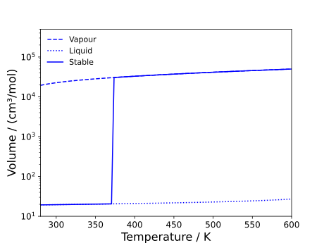

# Bulk Properties

Bulk properties are those properties which refer to a single phase at a given set of conditions (for both pures and mixtures).
A more comprehensive list of the bulk properties available in Clapeyron can be found [here](../properties/bulk.md).

The notebooks associated with this tutorial can be found [here](../../../examples/bulk_properties.ipynb).

## Bulk properties of water

As a simple first step, let us just estimate the volume of water at 298.15 K and 1 bar using PC-SAFT:

```julia
julia> model = PCSAFT(["water"])
PCSAFT{BasicIdeal, Float64} with 1 component:
 "water"
Contains parameters: Mw, segment, sigma, epsilon, epsilon_assoc, bondvol

julia> volume(model,1e5,298.15)
1.9539250955201878e-5
```

And that's it! However, technically, water has two volume roots at these conditions; unless the phase is specified, Clapeyron will pick the phase with the lowest Gibbs free energy.
You can force the solvers to pick the vapour root by:

```julia
julia> volume(model,1e5,298.15;phase=:vapour)
0.022334042473509567
```

This may be of use when trying to study metastable regions or, if the users is certain of the phase type, speed up calculations.
The results are visualised below.
Note that this feature is available for all bulk property methods.



Let us now calculate the isobaric heat capacity of water using the same process:

```julia
julia> isobaric_heat_capacity(model,1e5,298.15)
42.57610895303115
```

Those familiar with water will know that this value is far too small.
This is because, when a model is assembled by Clapeyron, it is assumed that all species only experience translational modes of motion.
This is not true in polyatomic molecules where these experience rotational and vibrational models.
These can be included in the model by specifying a different ideal model:

```julia
julia> model = PCSAFT(["water"]; idealmodel=ReidIdeal)
PCSAFT{ReidIdeal, Float64} with 1 component:
 "water"
Contains parameters: Mw, segment, sigma, epsilon, epsilon_assoc, bondvol

julia> isobaric_heat_capacity(model,1e5,298.15)
55.44925782004192
```

This is now a bit closer to the true value.
The inclusion of a more-accurate ideal model is required when trying to estimate temperature-derivative properties (entropy, heat capacities, speed of sound, isentropic compressibility and Joule-Thomson coefficient).
This is visualised below:


## Bulk properties of water and hexane

One can obtain bulk properties of mixtures by simply specifying the molar amount of each component.
Here, let us consider a mixture of water and carbon dioxide:

```julia
julia> model = PCSAFT(["water","carbon dioxide"])
PCSAFT{BasicIdeal, Float64} with 2 components:
 "water"
 "hexane"
Contains parameters: Mw, segment, sigma, epsilon, epsilon_assoc, bondvol

julia> volume(model,1e5,298.15,[0.5,0.5])
0.0240608293527103
```

Everything that was true in the case of pure water will also hold here.
However, there is one limitation: by default, Clapeyron does not check whether or not the mixture is stable at a given set of conditions.
In the case of water and carbon dioxide at these conditions, we would expect a phase split between a vapour and liquid.
As such, there technically no single-phase volume at these conditions.
To determine the composition of each phase at these conditions, one would need to use a [flash algorithm](./tp_flash.md).
The difference between these results in shown below:

