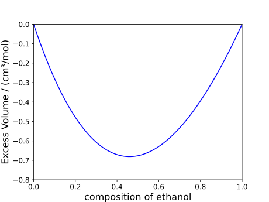
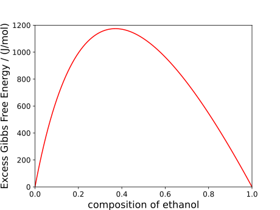

# Mixing and excess functions

The notebooks associated with this tutorial can be found [here](../../../examples/mixing_functions.ipynb).

While we showed how one can obtain [bulk properties](./bulk_properties.md) for both pure and multi-component systems, in the case of mixtures specifically, it is often the case that we wish to obtain the mixing function of a property.
For a given property, $Z$. This is defined as:
$$
\Delta Z_\text{mixing} = Z_\text{mix}-\sum_i x_iZ_i
$$
where variables denoted by the index refer to properties relating to component $i$ (with $x_i$ being the molar composition of $i$ within the mixture).
Due to this easily generalisable definition, rather than defining many `mixing_X(model, p, T, n)` functions, a single `mixing(model, p, T, n, property)` function is defined where the `property` input refers to the property which we wish to obtain the mixing function of.
For example, consider the mixing volume of ethanol and water:

```julia
julia> model = PCSAFT(["water","ethanol"])
PCSAFT{BasicIdeal, Float64} with 2 components:
 "water"
 "ethanol"
Contains parameters: Mw, segment, sigma, epsilon, epsilon_assoc, bondvol

julia> mixing(model, 1e5, 298.15, [0.5,0.5], volume)
-6.762389732537035e-7
```

The above should hold true for all other bulk properties as well.
The results are visualised below:


Furthermore, another similar property users might be interested is excess functions, which are slightly different than mixing functions:
$$
\Delta Z_\text{excess} = \Delta Z_\text{mixing}-\Delta Z_\text{mixing, id.}
$$
where we are now interested in deviations of mixing functions from ideal mixing functions.
This is only really relevant in the case of excess Gibbs free energies or excess entropies as, for most other properties, the excess function is identical to the mixing function.
The process to obtain these functions is identical to the `mixing` function mentioned previously where we now have an `excess(model, p, T, n, property)` function, as demonstrated below for the excess Gibbs free energy (also in the case of water and ethanol):

```julia
julia> excess(model, 1e5, 298.15, [0.5,0.5], gibbs_free_energy)
1100.6568199629164
```

This is also visualised below:


!!! tip "Optional Arguments"
    Any optional arguments which can be passed to the bulk property functions can also be passed to the mixing and excess functions.
    See the documentations relating to [bulk properties](./bulk_properties.md) for more details.
