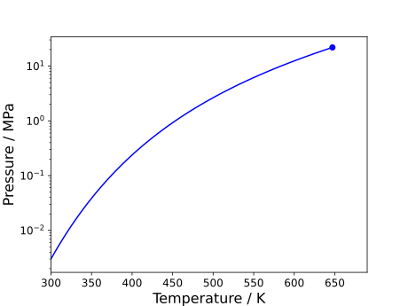
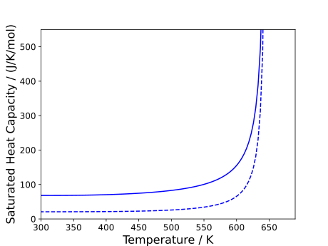

# Pure Saturation Properties

Saturation properties are often vital when understanding the global phase behaviour of a pure component. Such properties can be obtained in `Clapeyron.jl`.

The notebooks associated with this tutorial can be found [here](../../../examples/pure_saturation_properties.ipynb).

## Saturation curve of water

Let us take the case of obtaining the boiling point of water at atmospheric pressure using Peng-Robinson. This can be obtained using the `saturation_temperature(model,p)` function as shown below:

```julia
julia> model = PR(["water"])
PR{BasicIdeal, PRAlpha, NoTranslation, vdW1fRule} with 1 component:
 "water"
Contains parameters: a, b, Tc, Pc, Mw

julia> (Tsat, vl, vv) = saturation_temperature(model, 1e5)
(374.24014010712983, 2.26976016480195e-5, 0.03084938795573781)
```

Note that the outputs of this function are the saturation temperature, saturated liquid volume and saturated vapour volume. The predicted saturation temperature is pretty spot-on for a cubic although the liquid volume is a bit off (see documentation related to [model construction](./basics_model_construction.md) to see how cubics can be improved to better model complex systems).

If we wished to do the reverse operation, obtain the saturation pressure at a given temperature, this can be done using the `saturation_pressure(model, T)` function:

```julia
julia> (psat, vl, vv) = saturation_pressure(model,298.15)
(2686.6049469327368, 2.1391026105178707e-5, 0.9223293617932997)
```

In fact, if one wishes to trace the full saturation curve of a component, it is recommended to use this function instead. The primary reason for this is because, as one approaches the critical point, our solvers will become more unstable (just the nature of the critical region). As such, to obtain a smooth curve, it is often best to solve for the saturation conditions far from the critical point first, and then slowly approach the critical point, re-using values from lower temperatures as initial guesses for the next step. Consider an example for-loop below:

```julia
N    = 100

T    = LinRange(298.15, Tc, N)
psat = zeros(N)
vl   = zeros(N)
vv   = zeros(N)

for i in 1:N
    if i==1
        sat = saturation_pressure(model, T[i])
        psat[i] = sat[1]
        vl[i] = sat[2]
        vv[i] = sat[3]
        v0 = [vl[i],vv[i]]
    else
        sat = saturation_pressure(model, T[i]; v0=v0)
        psat[i] = sat[1]
        vl[i] = sat[2]
        vv[i] = sat[3]
        v0 = [vl[i],vv[i]]
    end
end
```

The resulting $pT$ curve is shown below:



As well as the $\rho T$ envelope:


### Using alternative methods

The default methods in `Clapeyron.jl` are generally intended for speed, with sacrifices to robustness. As such there will probably be a few cases where our default methods fail. While this could be remedied by the user providing their own initial guesses, an alternative would be to use a different method. In the case of the saturation solvers, we have a few alternatives listed [elsewhere](../properties/pure.md). This switch can be done as follows:

```julia
julia> @time saturation_pressure(model, 298.15)
  0.000024 seconds (11 allocations: 432 bytes)
(2686.6049469327368, 2.1391026105178707e-5, 0.9223293617932997)

julia> @time saturation_pressure(model, 298.15, IsoFugacitySaturation())
  0.000026 seconds (8 allocations: 480 bytes)
(2686.6049471489205, 2.139102610517806e-5, 0.9223293617190517)

julia> @time saturation_pressure(model, 298.15, SuperAncSaturation())
  0.000006 seconds (1 allocation: 32 bytes)
(2686.604947149002, 2.13910261051781e-5, 0.922329361719024)
```

In the case of cubics specifically, we provide the `SuperAncSaturation()` method which simply calls a highly-regressed Chebyshev polynomial which will be by far the fastest method.

## Critical points

Omitted from the example we gave earlier, one can also solve for the critical point of a pure component in `Clapeyron.jl` directly. This is done simply using the `crit_pure(model)` function:

```julia
julia> (Tc, pc, vc) = crit_pure(model)
(647.13, 2.19e7, 7.644674198270991e-5)
```

While, in the case of cubics, the critical point is an input, for equations of state such as SAFT, the critical point needs to be determined when trying to trace the saturation region.

## Obtaining properties along the saturation curve

Properties such as the enthalpy of vaporisation or saturated heat capacities can be quite important to determine. Ideally, once the saturation pressure and temperature is determined, one should be able to input those values into the bulk property calculators, specifying the respective phases. While this does work generally, this approach begins to fail at conditions approaching the critical point (unsurprisingly). In this case, we recommend using hidden functions in `Clapeyron.jl`, the `Clapeyron.VT_property(model, V, T, n)` functions. Rather than taking the pressure as an input, these functions take the system volume. As we have obtained these volumes from the saturation solvers, it ensures that we obtain the property related to the correct phase. This is shown below for the enthalpy of vaporisation saturated heat capacities:

```julia
N    = 100

T    = LinRange(298.15, Tc, N)
psat = zeros(N)
vl   = zeros(N)
vv   = zeros(N)

hL   = zeros(N)
hV   = zeros(N)
cpL  = zeros(N)
cpV  = zeros(N)

for i in 1:N
    if i==1
        sat = saturation_pressure(model, T[i])
        psat[i] = sat[1]
        vl[i] = sat[2]
        vv[i] = sat[3]
        v0 = [vl[i],vv[i]]
    else
        sat = saturation_pressure(model, T[i]; v0=v0)
        psat[i] = sat[1]
        vl[i] = sat[2]
        vv[i] = sat[3]
        v0 = [vl[i],vv[i]]
    end
    hL[i]  = Clapeyron.VT_enthalpy(model,vl[i],T[i],[1.])
    hV[i]  = Clapeyron.VT_enthalpy(model,vv[i],T[i],[1.])
    cpL[i] = Clapeyron.VT_isobaric_heat_capacity(model,vl[i],T[i],[1.])
    cpV[i] = Clapeyron.VT_isobaric_heat_capacity(model,vv[i],T[i],[1.])
end
```

The resulting plots are shown below:


As well as the saturated isobaric heat capacities:


